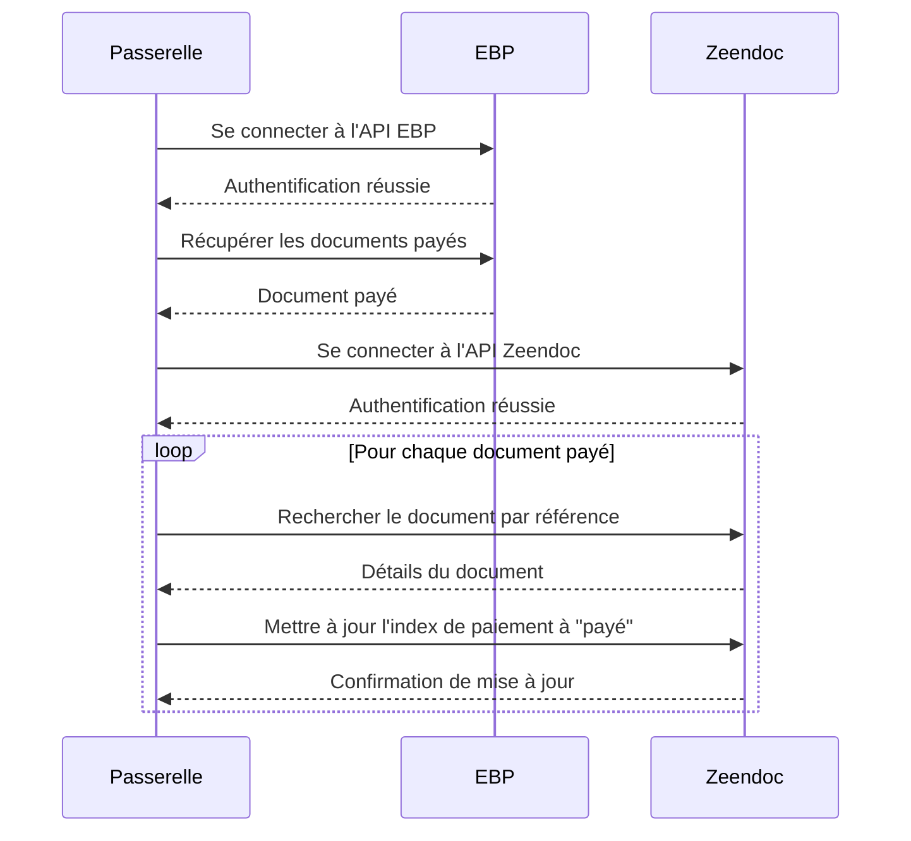
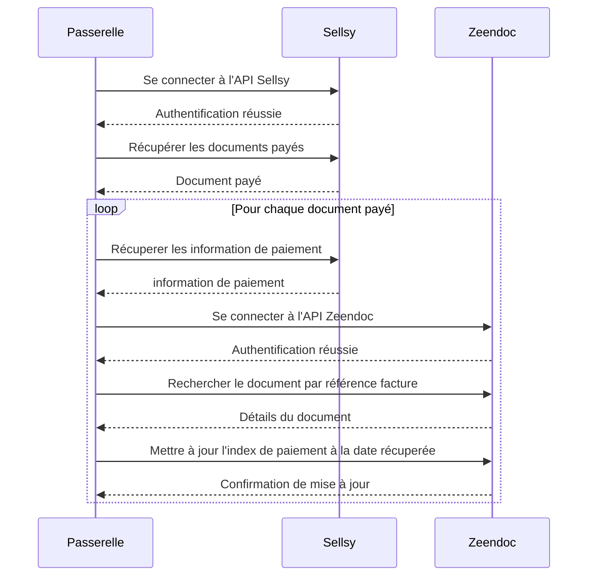
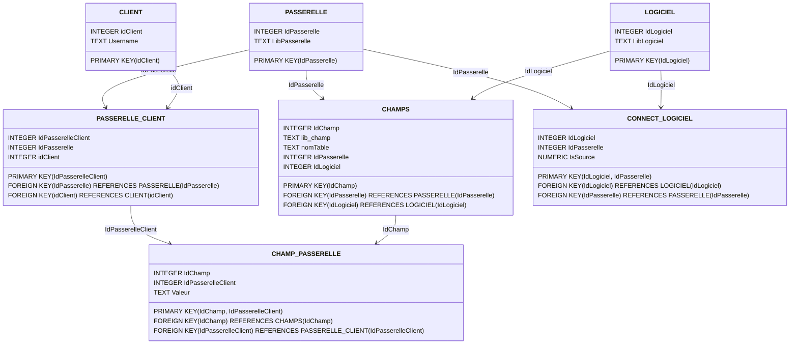

# Documentation de l’application Passerelle DELTIC

<aside>
❗ Cette documentation est destinée aux administrateurs de l’application passerelle DELTIC

</aside>

# Général

## Introduction

> Bienvenue dans la documentation utilisateur de la plateforme de la passerelle DELTIC. Cette plateforme permet de gérer les passerelles entre les solutions utilisées par l'entreprise DELTIC.
>

### 🥅 Objectifs de l'application

L’application as pour but de gérer les liens entre les logiciels des clients de la société DELTIC

<aside>
💡 GitHub : [ici](https://github.com/Mhivelin/passerelle_deltic)

</aside>

## ⚙️ Installation

1. Se connecter sur l’invite de commande du serveur (cf :  [👀](https://www.notion.so/Documentation-de-l-application-Passerelle-DELTIC-081440cb0d7044f6ae0f008c22b04ed3?pvs=21))
2. Cloner le dépôt :

    ```bash
    git clone https://github.com/Mhivelin/passerelle_deltic
    ```

3. Changer de répertoire courant pour aller dans le dépôt :

    ```bash
    cd passerelle_deltic
    ```

4. Créer un fichier .env ✏️

    ```bash
    nano app/.env
    ```

    Avec les valeurs suivantes :

    🚨 **Remplacer** les valeurs temporaires par les bonnes informations puis sauvegarder (ctrl + s) puis fermer (ctrl + x)

    ```bash
    ADMIN_USERNAME=nomadmin
    ADMIN_PASSWORD=motdepasseadmin
    SECRET_KEY=cléesecurisée
    JWT_SECRET_KEY=cléesecurisée
    IP=adresseipdelhote
    ```

    <aside>
    💡 comment trouver l’adresse IP ?
    `ip a`

    </aside>

5. Lancer le container docker

    ```bash
    sudo docker compose up -d
    ```


Voila votre application est lancée ✅ vous pouvez la retrouver sur le port 5000 de votre serveur.

- en cas de problème, défilez ce menu ou vérifiez si une solution n’est pas apporté dans [Problèmes Courants et Solutions](csv_readme/%F0%9F%9A%A8%20Proble%CC%80mes%20Courants%20et%20Solutions%2088ff8eb43e1543299fe700ac8c96bcf5.md)

    ### 1. Mise à Jour du Système

    Avant d'installer des logiciels, il est important de mettre à jour les paquets de votre système Debian.

    ```bash
    bashCopy code
    sudo apt update
    sudo apt upgrade -y

    ```

    ### 2. Installation de Git

    Git est nécessaire pour cloner le dépôt du projet.

    ```bash
    bashCopy code
    sudo apt install git -y

    ```

    ### 3. Installation de Docker

    Docker est utilisé pour exécuter l'application dans un container.

    ### Installation des prérequis

    ```bash
    bashCopy code
    sudo apt install apt-transport-https ca-certificates curl gnupg lsb-release -y

    ```

    ### Ajout de la clé GPG de Docker

    ```bash
    bashCopy code
    curl -fsSL https://download.docker.com/linux/debian/gpg | sudo gpg --dearmor -o /usr/share/keyrings/docker-archive-keyring.gpg

    ```

    ### Ajout du dépôt Docker

    ```bash
    bashCopy code
    echo "deb [arch=amd64 signed-by=/usr/share/keyrings/docker-archive-keyring.gpg] https://download.docker.com/linux/debian $(lsb_release -cs) stable" | sudo tee /etc/apt/sources.list.d/docker.list > /dev/null

    ```

    ### Installation de Docker Engine

    ```bash
    bashCopy code
    sudo apt update
    sudo apt install docker-ce docker-ce-cli containerd.io -y

    ```

    ### Vérification de l'installation de Docker

    ```bash
    bashCopy code
    sudo docker run hello-world

    ```

    ### 4. Installation de Docker Compose

    Docker Compose est utilisé pour gérer les services de l'application.

    ```bash
    bashCopy code
    sudo curl -L "https://github.com/docker/compose/releases/download/1.29.2/docker-compose-$(uname -s)-$(uname -m)" -o /usr/local/bin/docker-compose
    sudo chmod +x /usr/local/bin/docker-compose

    ```

    ### Vérification de l'installation de Docker Compose

    ```bash
    bashCopy code
    docker-compose --version

    ```

    ### 5. Clonage du Dépôt du Projet

    Clonez le dépôt contenant le code source de l'application.

    ```bash
    bashCopy code
    git clone https://github.com/Mhivelin/passerelle_deltic
    cd passerelle_deltic

    ```

    ### 6. Configuration des Variables d'Environnement

    Créez un fichier `.env` avec les variables nécessaires.

    ```bash
    bashCopy code
    nano app/.env

    ```

    Ajoutez les valeurs suivantes dans le fichier `.env` :

    ```bash
    bashCopy code
    ADMIN_USERNAME=nomadmin
    ADMIN_PASSWORD=motdepasseadmin
    SECRET_KEY=cléesecurisée
    JWT_SECRET_KEY=cléesecurisée
    IP=adresseipdelhote

    ```

    Sauvegardez (Ctrl + S) et fermez (Ctrl + X) l'éditeur.

    ### 7. Lancement de l'Application

    Utilisez Docker Compose pour lancer l'application.

    ```bash
    bashCopy code
    docker-compose up -d

    ```

    Voilà, votre application est maintenant configurée et en cours d'exécution sur une machine Debian. Vous pouvez accéder à l'application via l'adresse IP spécifiée.


### 🚨 Problèmes Courants et Solutions

[🚨 Problèmes Courants et Solutions](csv_readme/%F0%9F%9A%A8%20Proble%CC%80mes%20Courants%20et%20Solutions%2088ff8eb43e1543299fe700ac8c96bcf5.csv)

### ⌨️ Utilisation du serveur DELTIC

<aside>
💡 Comment se connecter au serveur OVH ?

</aside>

1. **Obtenir les Informations de Connexion 🔐**

    Vous aurez besoin des informations suivantes pour vous connecter au serveur Debian :

    - L'adresse IP : `vps-43199aa1.vps.ovh.net`
    - Le nom d'utilisateur : `debian`
    - Le mot de passe de l'utilisateur ou la clé SSH privée si vous utilisez l'authentification par clé publique. disponible sur `LastPass`
2. **Installer un Client SSH 🧑‍💻**

    ### Sur Windows

    - Vous pouvez utiliser PuTTY, un client SSH populaire pour Windows.
    - Téléchargez PuTTY depuis [le site officiel](https://www.putty.org/).
    - Installez PuTTY en suivant les instructions d'installation.

3. **Se connecter au la VM 🔌**
    1. Ouvrez PuTTY.
    2. Dans `Host Name (or IP address)` entrer `debian@vps-43199aa1.vps.ovh.net`
    3. cliquer sur `open`  (puis sur `Accept` seulement pour la première  utilisation)
    4. entrer le mot de passe (trouvé sur LastPass) 🚨 Attention, pour des raison de sécurité, les caractères tapé ne s’affichent pas 🚨

| Catégorie                | Commande                                                            | Description                                                                    |
| ------------------------ | ------------------------------------------------------------------- | ------------------------------------------------------------------------------ |
| Mise à jour du système   | sudo apt update                                                     | Met à jour la liste des paquets disponibles                                    |
|                          | sudo apt upgrade -y                                                 | Installe les mises à jour des paquets déjà installés                           |
| Gestion des paquets      | sudo apt install <package> -y                                       | Installe un paquet spécifié                                                    |
|                          | sudo apt remove <package> -y                                        | Supprime un paquet spécifié                                                    |
|                          | dpkg -i <package.deb>                                               | Installe un paquet .deb téléchargé manuellement                                |
| Gestion des services     | sudo systemctl start <service>                                      | Démarre un service                                                             |
|                          | sudo systemctl stop <service>                                       | Arrête un service                                                              |
|                          | sudo systemctl restart <service>                                    | Redémarre un service                                                           |
|                          | sudo systemctl status <service>                                     | Affiche l'état d'un service                                                    |
|                          | sudo systemctl enable <service>                                     | Active un service pour qu'il démarre au démarrage du système                   |
| Gestion des utilisateurs | sudo adduser <username>                                             | Ajoute un nouvel utilisateur                                                   |
|                          | sudo deluser <username>                                             | Supprime un utilisateur                                                        |
|                          | sudo passwd <username>                                              | Change le mot de passe d'un utilisateur                                        |
|                          | sudo usermod -aG <group> <username>                                 | Ajoute un utilisateur à un groupe                                              |
| Gestion des fichiers     | ls                                                                  | Liste les fichiers et répertoires dans le répertoire courant                   |
|                          | cd <directory>                                                      | Change de répertoire                                                           |
|                          | cp <source> <destination>                                           | Copie des fichiers ou répertoires                                              |
|                          | mv <source> <destination>                                           | Déplace ou renomme des fichiers ou répertoires                                 |
|                          | rm <file>                                                           | Supprime un fichier                                                            |
|                          | rm -r <directory>                                                   | Supprime un répertoire et son contenu                                          |
| Gestion des processus    | ps aux                                                              | Affiche les processus en cours d'exécution                                     |
|                          | htop                                                                | Version améliorée de top (nécessite l'installation : sudo apt install htop -y) |
|                          | kill <PID>                                                          | Termine un processus en utilisant son ID de processus                          |
| Réseau                   | ifconfig                                                            | Affiche les configurations réseau                                              |
|                          | ping <host>                                                         | Envoie des paquets ICMP ECHO_REQUEST à un hôte                                 |
|                          | wget <url>                                                          | Télécharge des fichiers depuis le web                                          |
|                          | ssh <user>@<host>                                                   | Se connecte à un hôte distant via SSH                                          |
| Docker                   | sudo systemctl start docker                                         | Démarre le service Docker                                                      |
|                          | sudo systemctl stop docker                                          | Arrête le service Docker                                                       |
|                          | sudo systemctl enable docker                                        | Active Docker au démarrage du système                                          |
|                          | docker build -t <name> .                                            | Construit une image Docker à partir d'un Dockerfile                            |
|                          | docker run -d -p <host_port>:<container_port> --name <name> <image> | Exécute un container en arrière-plan                                           |
|                          | docker ps                                                           | Affiche les containers Docker en cours d'exécution (avec container_id)         |
|                          | docker run -d -p <host_port>:<container_port> --name <name> <image> | Exécute un container en arrière-plan                                           |
|                          | docker ps                                                           | Affiche les containers Docker en cours d'exécution                             |
|                          | docker stop <container_id>                                          | Arrête un container Docker                                                     |
|                          | docker rm <container_id>                                            | Supprime un container Docker                                                   |
|                          | docker-compose up -d                                                | Démarre les services définis dans un fichier docker-compose.yml                |
|                          | docker-compose down                                                 | Arrête et supprime les containers définis dans un fichier docker-compose.yml   |
|                          | docker logs <container_id>                                          | Affiche les logs d'un container Docker                                         |
| Git                      | git clone <repository_url>                                          | Clone un dépôt Git vers le répertoire courant                                  |
|                          | git status                                                          | Affiche l'état des modifications dans le dépôt                                 |

## Utilisation de base

### Ajout d’administrateur :

1. Se rendre dans les paramètres en haut a droite ⚙️
2. Cliquer sur [`Ajouter un utilisateur`](http://localhost:5000/register)  dans `Gestion des utilisateurs` ➕
3. Entrer le nouveau nom d’utilisateur et le mot de passe 🖍️
4. Se reconnecter a l’application (avec l’ancien ou le nouvel utilisateur) 🔓

### Connection d’une nouvelle passerelle

# 🧑‍💻 Les logiciels

## 📄 Zeendoc

| Nom                | ❔Comment l’obtenir ? |
| ------------------ | -------------------- |
| Zeendoc_Login      |                      |
| Zeendoc_URL_Client |                      |
| Zeendoc_CPassword  |                      |
| Zeendoc_CLASSEUR   |                      |

## 💵 EBP

| Nom                                             | ❔Comment l’obtenir ?                                                         |
| ----------------------------------------------- | ---------------------------------------------------------------------------- |
| Client ID                                       | Option 1 : Obtenu par le client lors de la mise en place de son logiciel EBP |
| Option 2 : Demander a l’intégrateur             |
| Client Secret                                   | Option 1 : Obtenu par le client lors de la mise en place de son logiciel EBP |
| Option 2 : Demander a l’intégrateur             |
| Subscription Key                                | Disponible sur le lien suivant : https://developpeurs.ebp.com/profile        |
| Se connecter avec le compte du client           |
| identifiants de connexion                       |
| (mail + mot de passe)                           | Option 1 : Le client fournis ces identifiants                                |
| Option 2 : le client participe à l’installation |

## ☁️ Sellsy

| Nom | ❔Comment l’obtenir ? |
| --- | -------------------- |
|     |

Sellsy Client ID

_____________________

Sellsy Client Secret | 1. 👀 Se rendre sur  https://www.sellsy.com/developer/api-v2
2. ➕ Créer un nouvel accès API de type Personnel (le nom de l’accès n’impactera pas la suite).
3. ❌ Ne pas cocher l’accès délégué.
4. ✅ laisser toutes les autorisation cochée
5. 🛟 Enregistrer.
🚨Attention, les information qui s’affiche maintenant ne seront plus visible par la suite donc penser a bien les enregistrer dans LastPass par exemple🚨 |

# 🤖 Les passerelles

## 💸 passerelle remontée de paiement **Sellsy --> Zeendoc**

> Il existe deux version de cette Passerelle, la version `Date` qui remonte la date 📆 du dernier  paiement et la version `statut` qui remonte simplement l’information de paiement ✅
>

### Prérequis

<aside>
💡 pour ajouter un client a la passerelle, vous aurez besoin de quelques informations au préalable.

</aside>


### **⚙️ Configuration d’un nouveau client**

1. Cliquer sur  “Ajouter un client” pour se rendre sur la page d’ajout d’un client.
2. Entrer le nom du client et valider en cliquant sur ajouter.
3. Sur la page d’accueil, cliquer sur détail puis sur “connecter une passerelle”.
4. choisir la passerelle “remontée de paiement” et cliquer sur ajouter.
5. Sur la page d’accueil, cliquer sur détail puis sur "Ajouter/modifier des champs requis”.
6. remplir les champs  `EBP_Client_ID`  `EBP_Client_Secret` `EBP_Subscription_Key` `Zeendoc_Login` `Zeendoc_URL_Client` `Zeendoc_CPassword` puis cliquer sur ajouter.
7. retourner sur “Ajouter/modifier des champs requis” et cliquer sur “Se connecter à EBP : `Connexion`”
8. Apres la redirection :
    - OPTION 1 : **Page de connexion d’ebp** : se connecter avec les identifiants de connexion du client
    - OPTION 2 : **Page d’erreur 404** : les information renseigné dans  `EBP_Client_ID` ou `EBP_Client_Secret` ou  `EBP_Subscription_Key` sont erronée.
    - OPTION 3 : connexion au mauvais compte : en cas de connexion automatique a un autre compte EBP, refaire la manip en navigation privée
9. retourner sur “Ajouter/modifier des champs requis” et sélectionner `Dossier EBP` `Classeur Zeendoc` `INDEX_STATUT_PAIEMENT` et `INDEX_NUM_PIECE` puis ajouter.
10. Vérifier le bon fonctionnement sur le logiciel zeendoc
11. Bravo 😀 !!

### 🖍️ Schéma explicatif



## 👤Passerelle remontée de fournisseur

## Passerelle remontée de paiement Sellsy —> Zeendoc



# Models

[Points de terminaison (1)](csv_readme/Points%20de%20terminaison%20(1)%2071171e08c975430baebc1adaa53cb3be.csv)

# 🔌 Points de terminaison

<aside>
💡 les points de terminaison sont les url utilisé par l’application pour faire les appels aux APIs et à la base de donnée
DEF :

</aside>

[Points de terminaison](csv_readme/Points%20de%20terminaison%20a8900f9335b44afcab8efefb8af663e8.csv)

# Base de donnée

